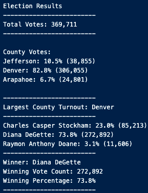
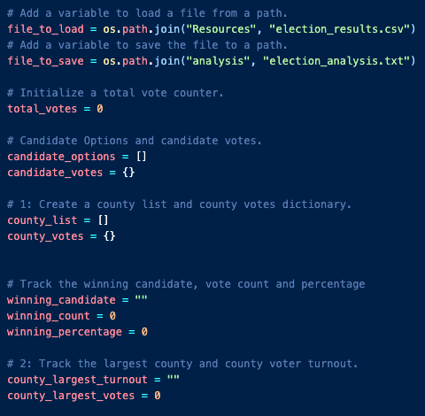
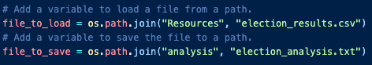
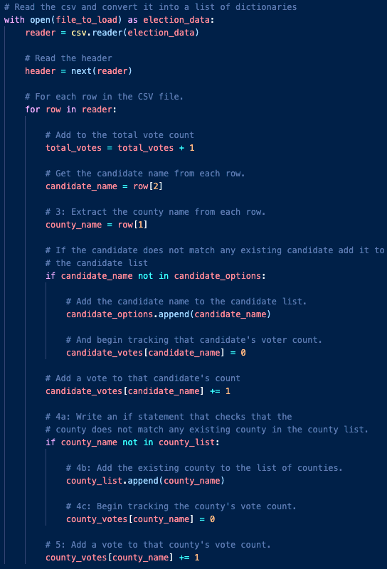

# Colorado Election Audit

## Project Overview
A Colorado Board of Elections employee has give me the following tasks to complete the election audit of a recent local congressional election.

1. Calculate the total number of votes cast.
2. Calculate the total amount of votes by county, with percentages of overall votes
3. Get a complete list of the candidates who received votes.
4. Calculate the total number of votes each candidate received.
5. Calculate the percentage of votes each candidate won.
6. Determine the county with the largest voter turnout
7. Determine the winner of the election based on popular vote.

## Resources
- Data Source: election_results.csv
- Software: Python 3.9.7, Visual Studio Code 1.65.2

## Results
The analysis of the election show that:
- There were 369,711 votes cast in the election.
- The counties involved were:
  - Jefferson
  - Denver
  - Arapahoe
- The county turnouts were:
  - Jefferson had 38,855 votes cast, which was 10.5% of the overall turnout
  - Denver had 306,055 votes cast, which was 82.8% of the overall turnout
  - Arapahoe had 24,801 votes cast, which was 6.7% of the overall turnout
- The county with the largest voter turnout was:
  - Denver, with 306,055 votes cast (82.8% of total turnout)
- The candidates were:
  - Charles Casper Stockham
  - Diana DeGette
  - Raymon Anthony Doane
- The candidate results were:
  - Charles Casper Stockham received 23.0% of the vote and 85,213 total votes.
  - Diana DeGette received 73.8% of the vote and 272,892 total votes.
  - Raymon Anthony Doane received 3.1% of the vote and 11,606 total votes.
- The winner of the election was:
  - Diana DeGette, who received 73.8% of the vote and 272,892 total votes.

## Election-Audit Summary
While the current script was created with this one election in mind, its structure allows it to be reused for future elections through light modifications. 

The first part of the code creates the variables that house the candidates up for election, the counties where voting is occurring, the votes obtained by each candidate, the votes cast in each county, and ultimately the winner of the election and county with the largest turnout. The first modification to be made is the the file loading path. 

To run this code on other elections, one must make sure the new data is saved in an accessible area. Next, all one must do is change the "election_results.csv" to the name of the file with the new data. With the rest of the variables already set up, this code will capture the candidates and counties in the new data just as it did with this Colorado election using the code below:

Through the code provided above, one other possible modification is if this code was used for a country wide election rather than a state election. For example, this code can be used for any upcoming presidential election if the data provided captured all candidate names and states from which the ballots came from. If this were the case, the "county_list" variable could be changed to "state_list" and "county_votes" dictionary to "state_votes". Other than those minor adjustments, if the csv file had the same format ("Ballot ID", "State", "Candidate"), then the code would run the same and provide election results at an even larger level.
